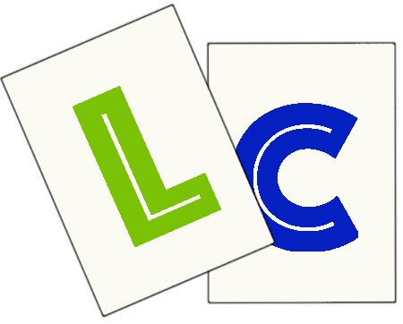

|<a href="Nouvelles.html">Nouvelles</a>|<a href="Galerie.html">Galerie</a>|<a href="A propos.html">&Agrave; propos</a>|<a href="Decouvrir.html">D&eacute;couvrir les produits</a>|<a href="FAQ.html">FAQ</a>|
|---|---|---|---|---|

#Nouvelles

Tenez. Un text que je peux allonger sans probl&egrave;mes. Je peux m&ecirc;me mettre des images l&agrave;-dedans.
 C'est quand m&ecirc;me tr&egrave;s difficile de mettre les accents, il faut &eacute;crire "&<i>nom de la lettre</i>acute/grave/circ; &agrave; chaque fois. Donc je vais arr&ecirc;ter d'&eacute;crire.

<a href="https://www.facebook.com/ludicartesjeux/">ludicartesjeux

<a href="https://www.instagram.com/ludicartes/">ludicartes

</body>
</html>
